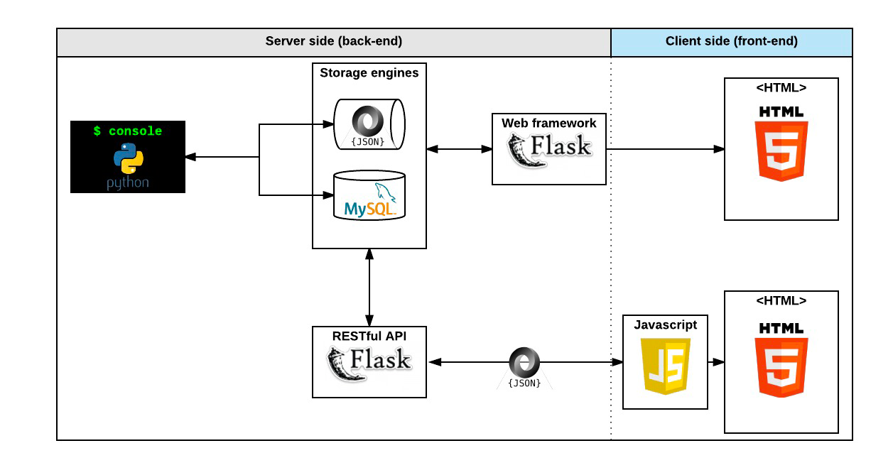

# AirBnB_clone

<B>Description</B>

This project aims to clone Airbnb's application and websites, utilizing a Python console as the central interface. The project is managed through the command line (cmd) interface, and data is stored, retrieved, and exchanged using JSON and SQL. We leverage the Flask web framework to expose a RESTful API, enabling communication between the console, backend, and a static web frontend.

Tech Stack:

Backend: Flask for Python
Templating: Jinja2
Database: SQL for users, MongoDB for JSON files
Frontend: HTML, JavaScript
Key Features:

User Authentication
Property Listing
Reservation Management
Project Structure:

console/: Python console application
static/: Directory for static web content
templates/: HTML templates
api/: Flask RESTful API
Serialization:

JSON: Console data interactions
SQL: User accounts
MongoDB: Storage for JSON files
User Stories/Use Cases:

Register, log in, and manage user profiles
Browse property listings and view details
Make reservations and manage bookings
The Flask API connects the console to a static web frontend, enabling seamless communication and dynamic features powered by JSON data.

<B>License</B>

Public Domain, no copyright protection

Feedback and contributors are welcomed. Reach out to either authors